# Flujo de Usuario – Módulo Teléfono (MeseroWatch)

## 1. Inicio de sesión
El mesero o administrador inicia sesión con sus credenciales. La contraseña es validada por reglas de seguridad.

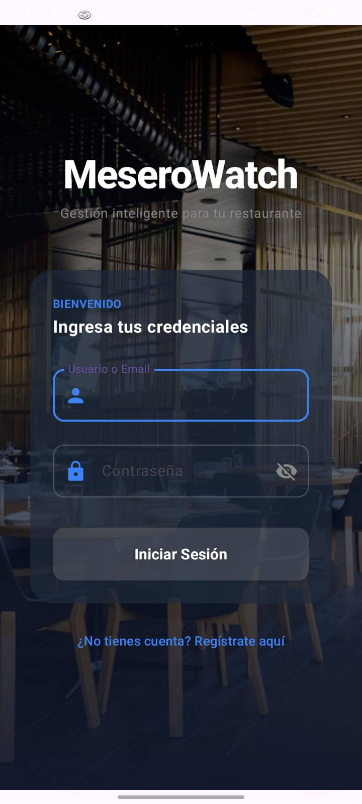

- **Usuario:** `admin` → Panel de administrador.
- **Usuario:** cualquier nombre registrado en Firebase → Panel de mesero.
- La contraseña debe cumplir con los requisitos (8 caracteres, mayúscula, número, carácter especial).
- Si es incorrecta, se muestra un mensaje de error.

---

## 2. Registro de nuevo usuario
Desde la pantalla de login, se puede acceder al formulario de registro.

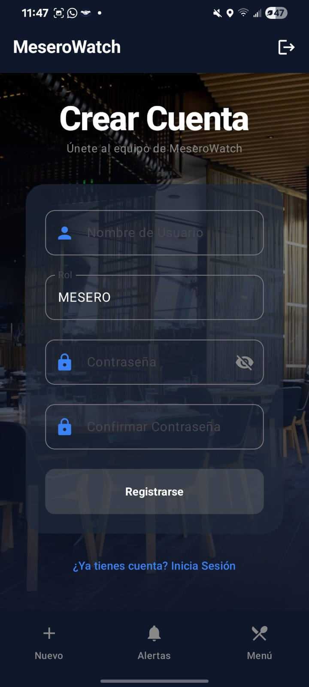

- Selección de rol (MESERO, CHEF, CAJERO). No se permite crear ADMIN desde aquí.
- Se guarda el usuario en Firebase Realtime Database.

---

## Panel del Mesero
El mesero accede a tres pestañas principales:

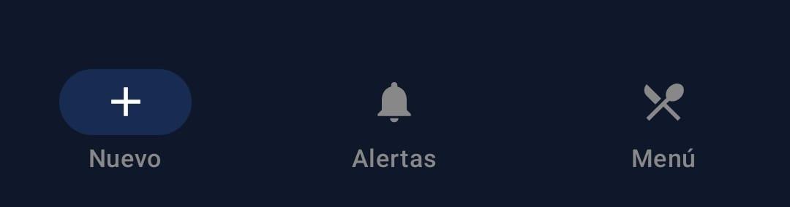

### 3. Tomar un nuevo pedido – Selección de mesa
Al ingresar a "Nuevo", el mesero ve una cuadrícula de mesas.

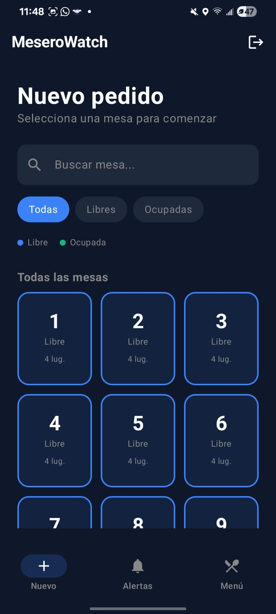

- Se muestra estado (Libre / Ocupada) por colores.
- Solo puede seleccionar mesas libres.
- Las mesas se obtienen de Firebase (por defecto 12 más las configuradas por el admin).
- También se puede buscar una mesa por número.

### 4. Elección de platillos
Al seleccionar una mesa libre, se muestra el menú del restaurante.

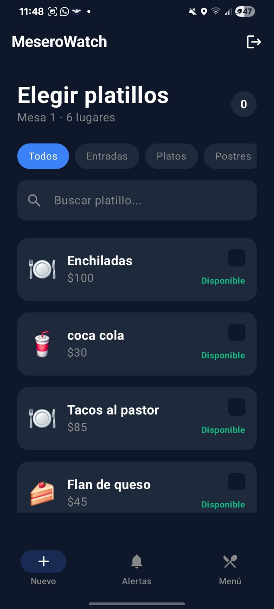

- Los platillos se cargan desde Firebase.
- Se pueden filtrar por categoría.
- Se marca con un check los platillos seleccionados.
- Los platillos no disponibles aparecen atenuados y no se pueden elegir.

### 5. Resumen del pedido
Al tocar "Ver pedido", se muestra la lista de platillos elegidos con la posibilidad de ajustar cantidad y agregar notas por cada orden.

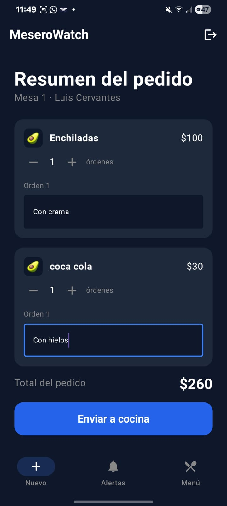

- Se pueden cambiar las cantidades o eliminar platillos.
- Se puede agregar una nota específica para cada unidad del platillo.
- Al presionar "Enviar a cocina", se guarda en Firebase con estado `EN_PREPARACION`.

### 6. Alertas de pedidos
El mesero ve todos los pedidos activos organizados por estado.

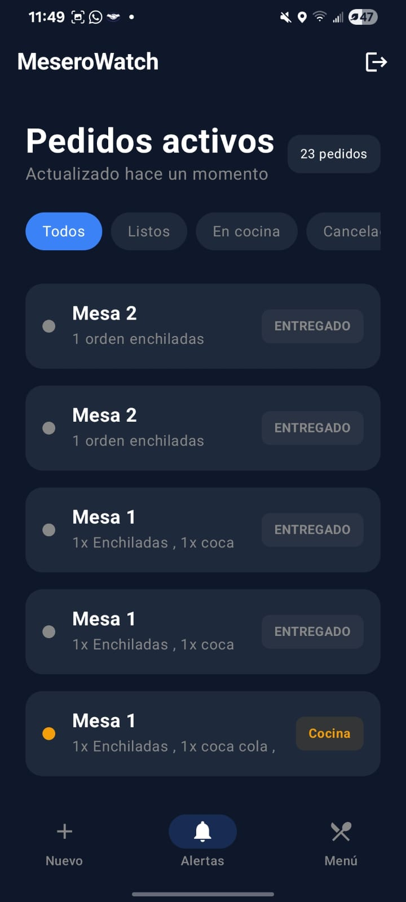

- Se muestra el número de mesa, descripción y estado.
- Al tocar un pedido se abre un diálogo con el detalle completo.

### 7. Menú del mesero (solo lectura)
El mesero puede consultar el menú para ver precios y disponibilidad, pero no modificarlo.

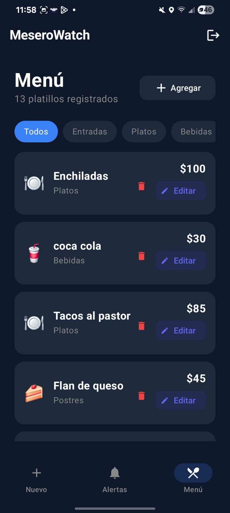

---

## Panel del Administrador
El administrador tiene acceso a funciones de gestión.

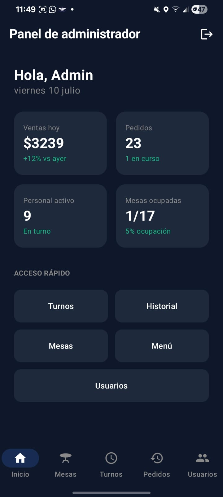

### 8. Gestión de mesas
Permite agregar mesas adicionales a las 12 por defecto, ver estado actual y ocupación.

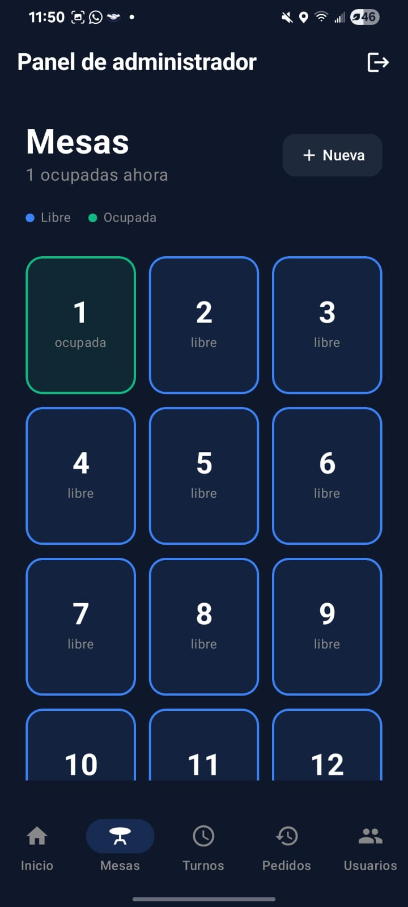

### 9. Gestión de turnos / personal
Visualiza la lista de empleados, su estado (Activo, Inactivo, En descanso) y rol.

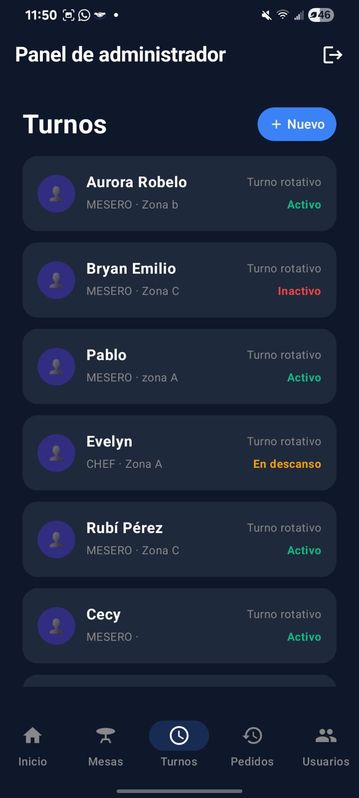

- Botón "Nuevo" abre un formulario para registrar un empleado.
- Al tocar un usuario se abre la edición para cambiar rol, zona asignada o estado.

### 10. Historial de pedidos
Muestra todos los pedidos realizados (sin filtro de estado), ordenados por los más recientes.

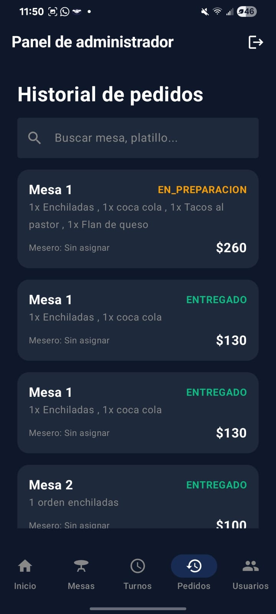

### 11. Gestión del menú
El administrador puede agregar, editar o eliminar platillos, y alternar su disponibilidad.

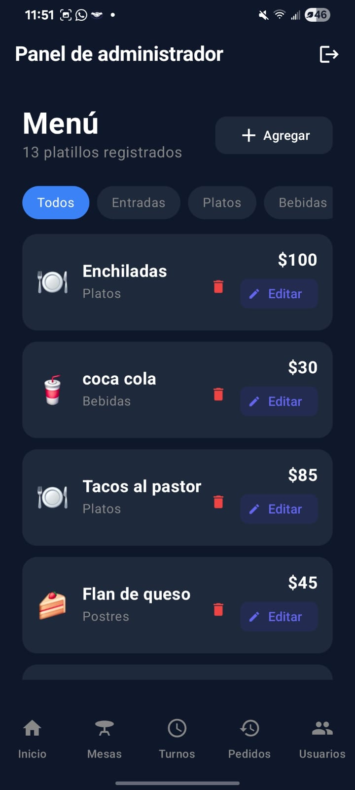

- Diálogo para crear o editar un platillo: nombre, categoría, precio y switch de disponible.

### 12. Gestión de zonas
Permite crear, editar y eliminar zonas (ej. Terraza, Salón, Barra) y asignarles personal.

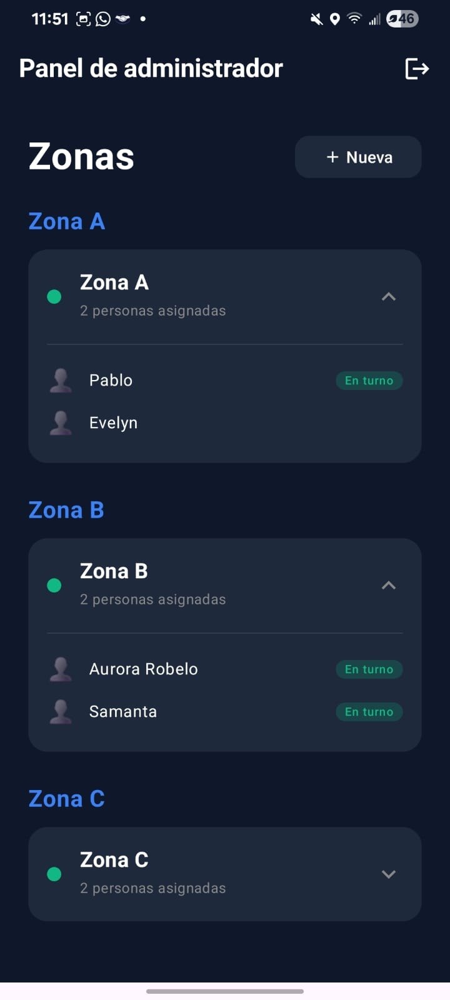

- Al mantener presionada una zona se puede editar o eliminar.

---

**Nota:** Todas las pantallas se comunican en tiempo real con Firebase Realtime Database. Las operaciones se reflejan instantáneamente en el módulo del reloj (Wear OS) y viceversa.