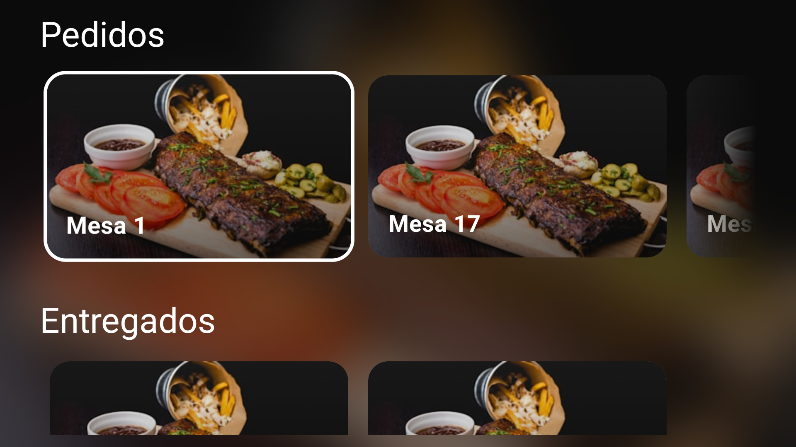
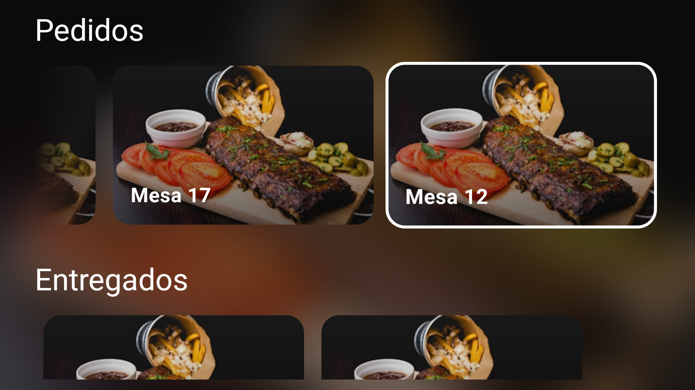
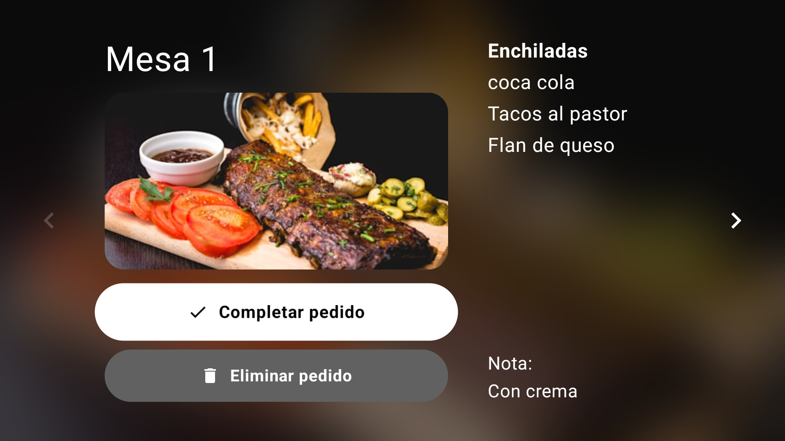
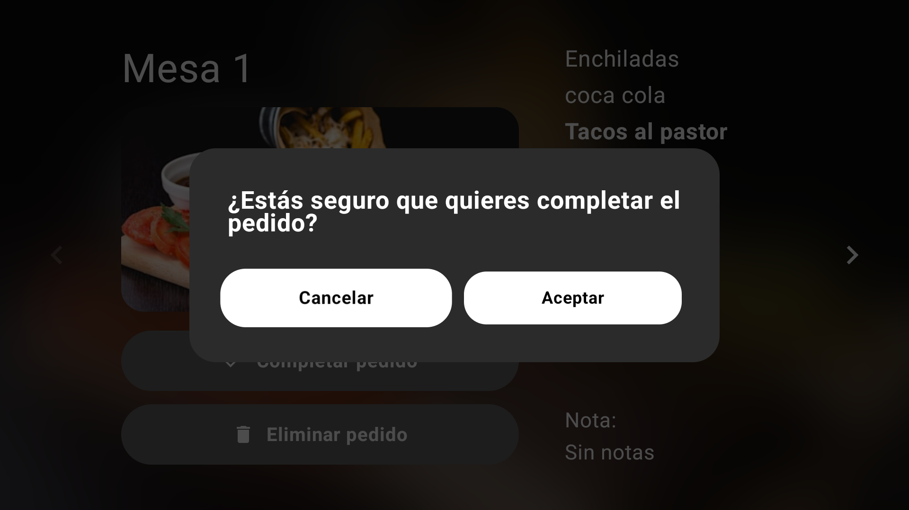
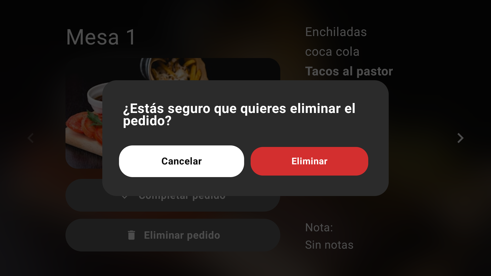
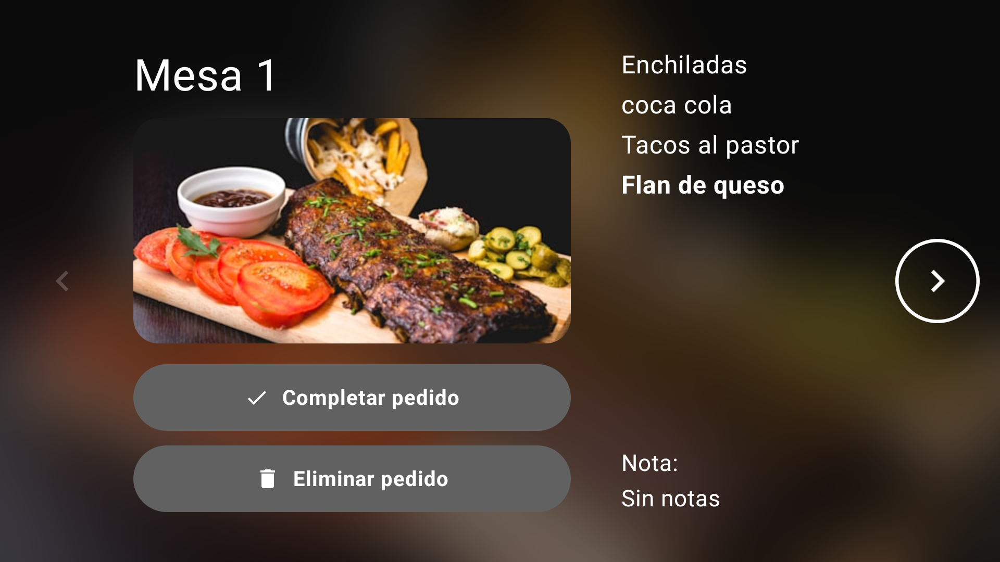
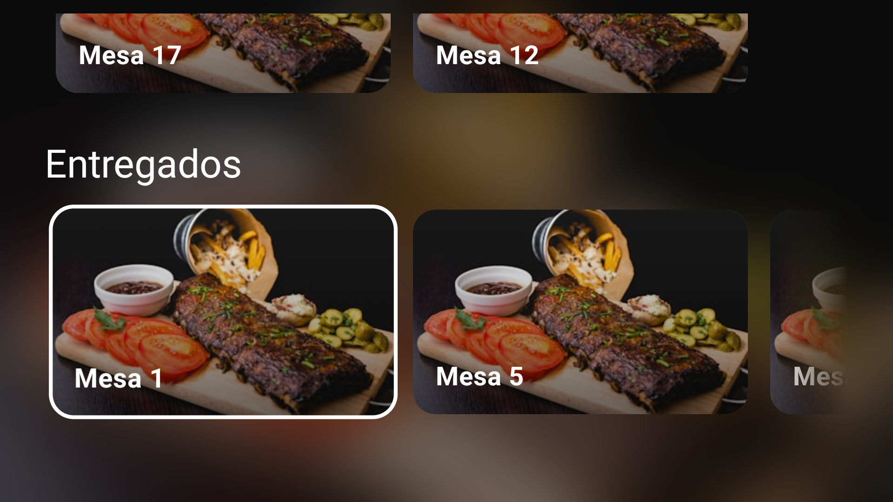
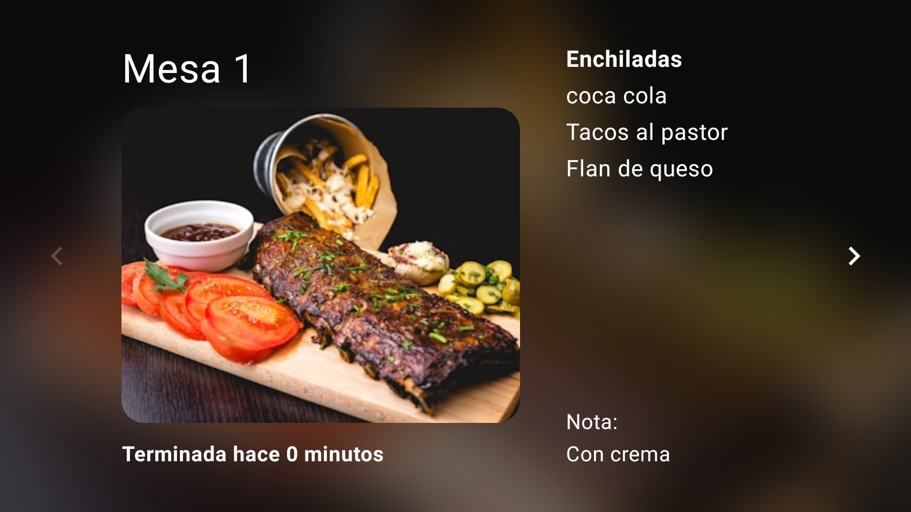

# Flujo de Usuario – Módulo TV (Cocina)

## 1. Pantalla principal – Tablero de pedidos
La pantalla de la cocina muestra dos secciones:

- **Pedidos** (en preparación)
- **Entregados** (listos para servir)

Cada pedido se muestra como una tarjeta horizontal con imagen de fondo y número de mesa.

- **Navegación:** Usando las flechas del control remoto, el chef se desplaza por las tarjetas. Al enfocar una tarjeta, el fondo de toda la pantalla cambia dinámicamente a la imagen del pedido con un efecto de desenfoque.

- Al hacer clic en una tarjeta, se abre el **detalle del pedido**.

---

## 2. Detalle del pedido
Vista completa de un pedido seleccionado. Incluye:

- Número de mesa.
- Imagen del platillo.
- Lista de platillos individuales con rotación automática cada 10 segundos (si hay más de uno).
- Nota asociada al platillo activo.
- Controles de navegación: flecha izquierda/derecha para cambiar al pedido anterior/siguiente.

- **Botón "Completar pedido"**: Cambia el estado del pedido a `LISTO` y regresa al tablero.
- **Botón "Eliminar pedido"**: Cancela el pedido (estado `CANCELADO`).

---

## 3. Diálogos de confirmación
Antes de completar o eliminar un pedido, se muestra un diálogo de confirmación para evitar acciones accidentales.

- El foco inicial está en el botón "Cancelar" para evitar ejecuciones involuntarias.
- Al aceptar, se actualiza el estado en Firebase y se vuelve automáticamente al tablero.

---

## 4. Navegación entre pedidos
Desde el detalle de un pedido, el chef puede moverse entre todos los pedidos de la lista actual (Pedidos o Entregados) usando las flechas izquierda y derecha.

- Si es el primer pedido, la flecha izquierda aparece atenuada.
- Si es el último, la flecha derecha se atenúa.
- El botón "Atrás" del control remoto regresa al tablero principal.

---

## 5. Actualización en tiempo real
Los cambios realizados desde el teléfono (nuevo pedido, cambio de estado) se reflejan instantáneamente en la TV gracias al listener de Firebase.

- Si un pedido pasa de `EN_PREPARACION` a `LISTO`, se mueve automáticamente de la sección "Pedidos" a "Entregados".
- Al completar un pedido en la TV, el mesero recibe la notificación en el reloj (módulo Wear OS).

- Pantalla de mesa entregadas

---

## Flujo de datos (Arquitectura)
- **Firebase Realtime Database** almacena los pedidos.
- `PedidoRepositoryImpl` (capa Data) escucha cambios en tiempo real y los expone como `Flow`.
- Casos de uso (`ObservarPedidosUseCase`, `ActualizarEstadoPedidoUseCase`, `EliminarPedidoUseCase`) encapsulan la lógica de negocio.
- `KitchenViewModel` (capa Presentation) orquesta el estado de la UI y las acciones del usuario.
- La UI reacciona al estado mediante `collectAsState()`.

---