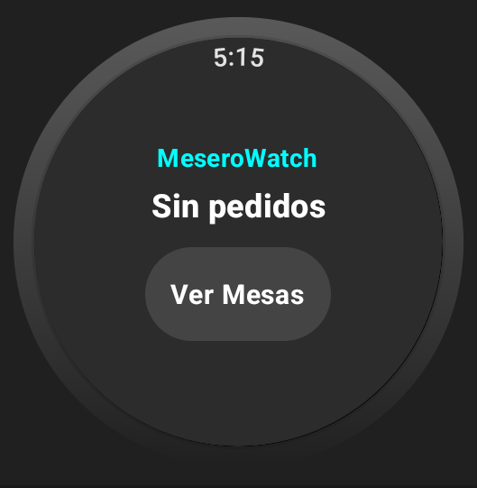
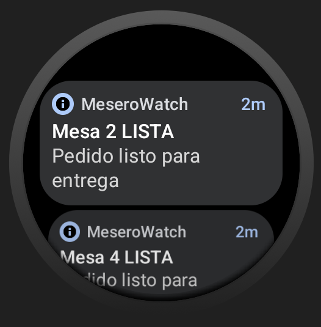
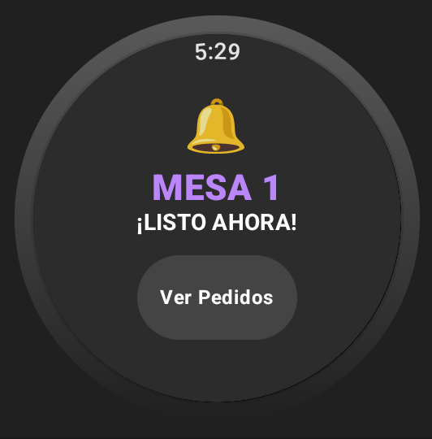
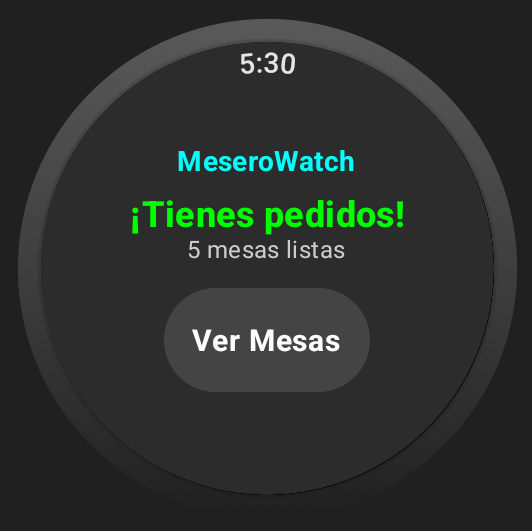
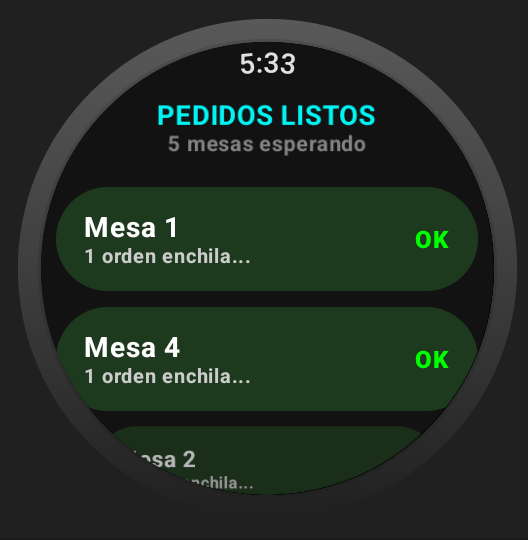
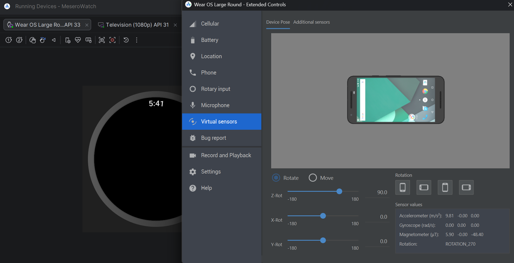
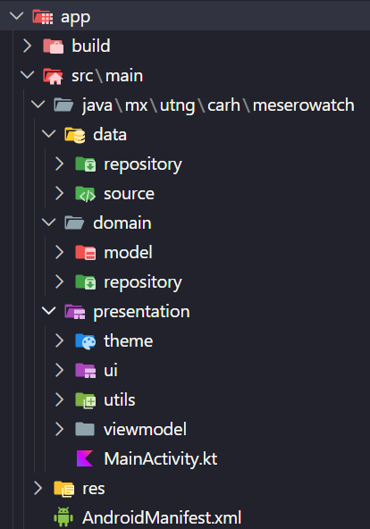

# Flujo de Usuario – Módulo Reloj (Wear OS)

## 1. Pantalla de Inicio (Sin pedidos)
El mesero ve la pantalla principal cuando no hay platillos listos.

- **Estado:** Sin pedidos en estado `LISTO`.
- **Elementos:** Título "MeseroWatch", mensaje "Sin pedidos", botón "Ver Mesas" (inactivo visualmente o solo muestra la lista vacía).

---

## 2. Llega un pedido listo – Notificación
Cuando un pedido cambia a estado `LISTO` en Firebase, el reloj:

- **Vibra** con un patrón largo (alerta).
- Muestra una **notificación** del sistema con el número de mesa.
- Navega automáticamente a la **pantalla de notificación** en la app.

- **Botón "Ver Pedidos"** lleva a la lista completa de pedidos listos.

---

## 3. Pantalla de Inicio (Con pedidos)
Si el mesero vuelve al inicio desde otra pantalla, verá el resumen de pedidos activos.

- **Chip "Ver Mesas"** abre la lista de pedidos listos.

---

## 4. Lista de Pedidos Listos
Muestra todos los pedidos cuyo estado es `LISTO`. Cada tarjeta incluye:

- Número de mesa.
- Descripción resumida del pedido (primeros 15 caracteres + "...").
- Botón "OK" para confirmar entrega.

- Al tocar **"OK"** en una tarjeta, se confirma la entrega (cambia el estado a `ENTREGADO` en Firebase) y la mesa desaparece de la lista.

---

## 5. Gestos de muñeca (Wrist Gestures)
La app incluye reconocimiento de gestos mediante el **giroscopio**:

| Gesto | Acción |
|-------|--------|
| **Giro rápido hacia arriba (eje Z positivo)** | Confirma la entrega del **primer pedido listo** automáticamente. |
| **Giro rápido hacia abajo (eje Z negativo)** | Posponer el **primer pedido listo** (vuelve a `EN_PREPARACION`). |

Al realizar un gesto, el reloj emite una **vibración corta de confirmación**.

---

## 6. Entrega completada – Retorno al inicio
Una vez que todos los pedidos listos han sido entregados, la lista queda vacía y la app regresa a la pantalla de inicio con el mensaje "Sin pedidos".

---

## Flujo de datos (Arquitectura)
- **Firebase Realtime Database** almacena todos los pedidos.
- El **DataSource** observa cambios en tiempo real.
- El **ViewModel** expone la lista de pedidos y ejecuta las operaciones de confirmación/posposición.
- Las pantallas reaccionan al estado mediante `collectAsStateWithLifecycle()`.

---