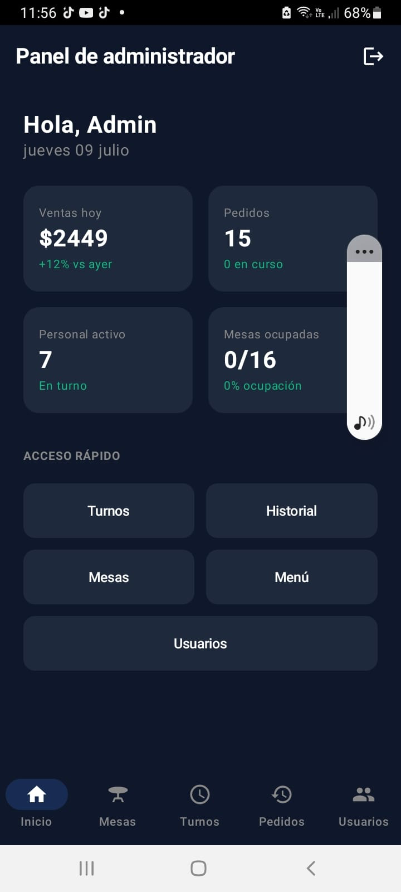
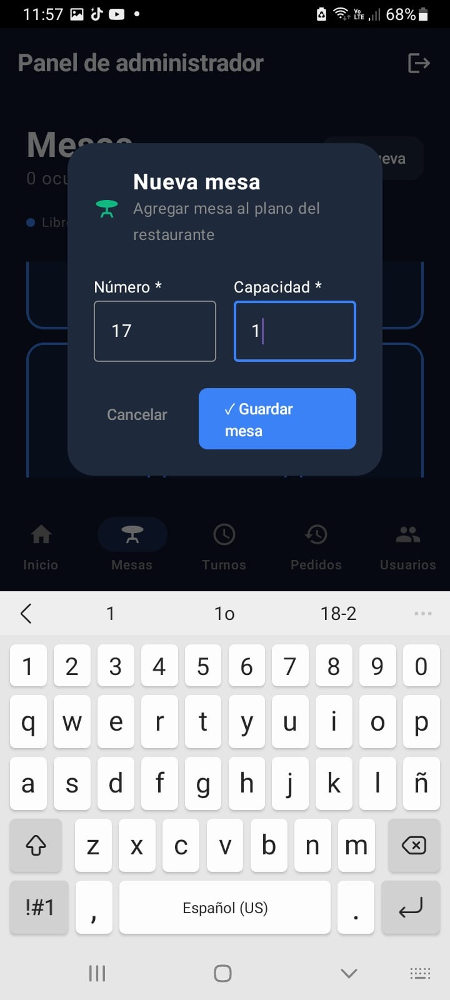
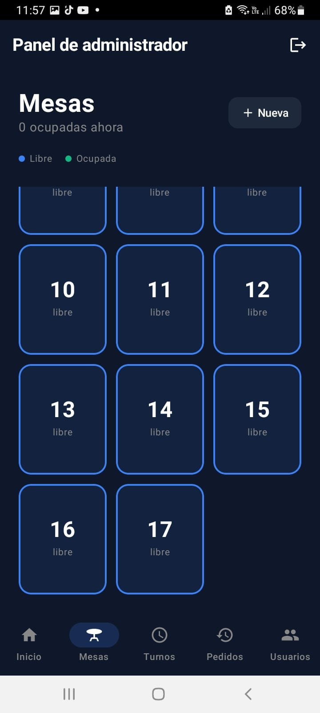
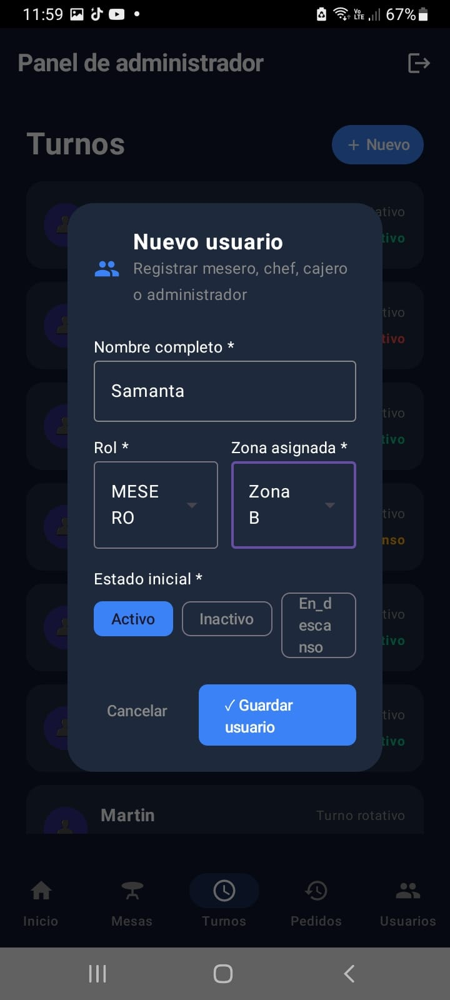
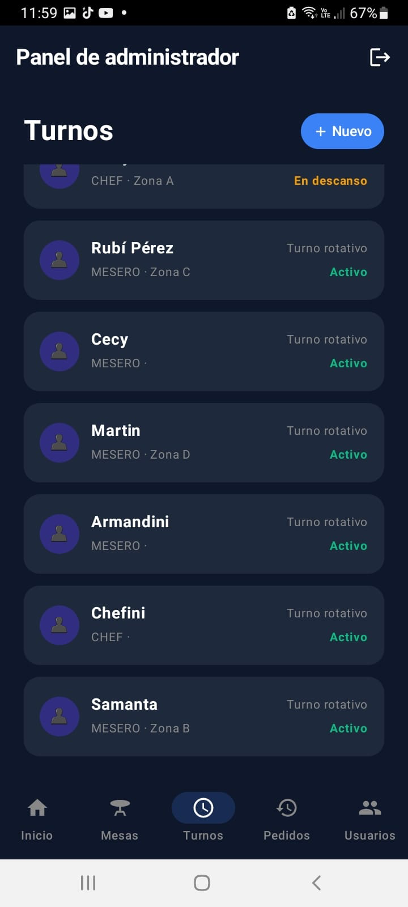
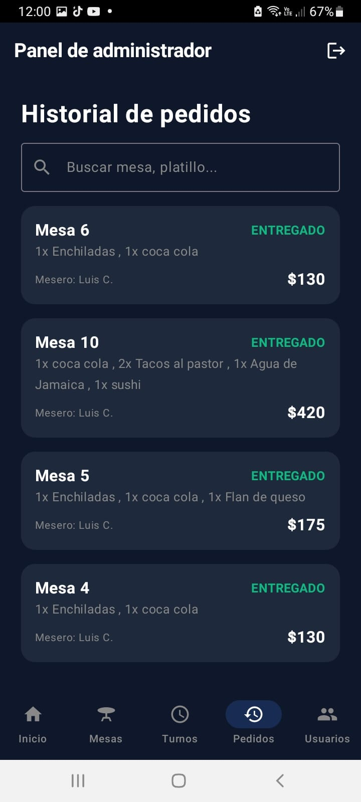
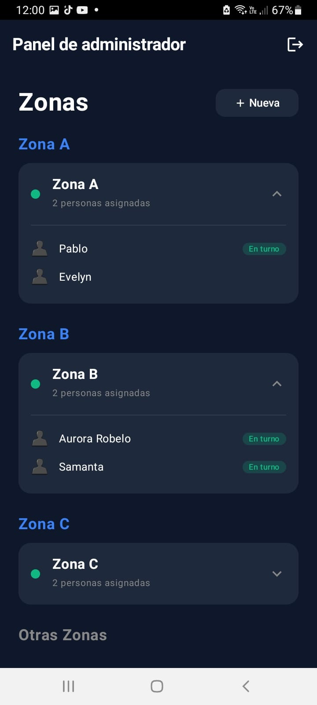

# Flujo de la Aplicación - Smart Restaurant

Este documento detalla el flujo de navegación y las capturas de pantalla de la aplicación móvil.

## 1. Pantalla de Principal / panel administrador

## 2. Agregar mesa

## 3. Listar mesas
  

## 4. Agregar usuario

## 5. Listar usuarios

## 6. Historial pedidos

## 7. Listar zonas con personal asignado
